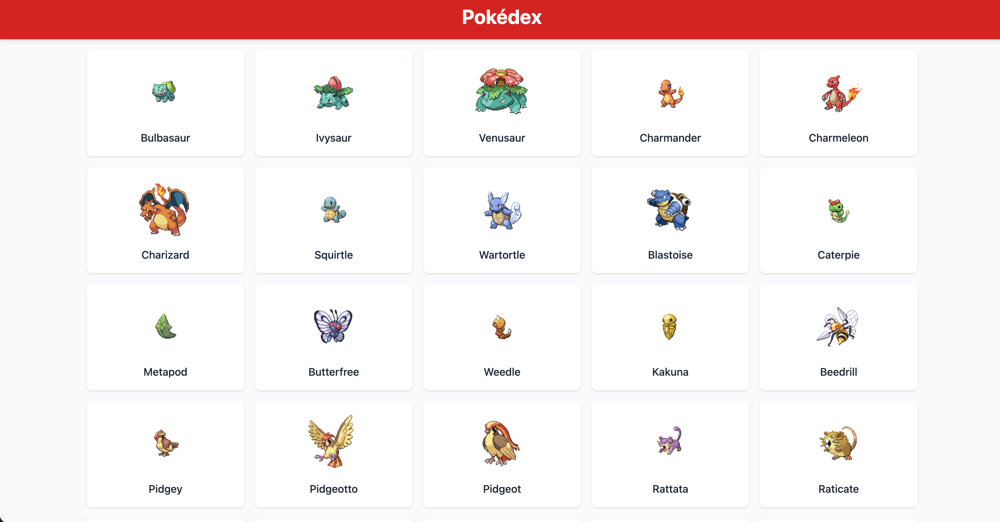
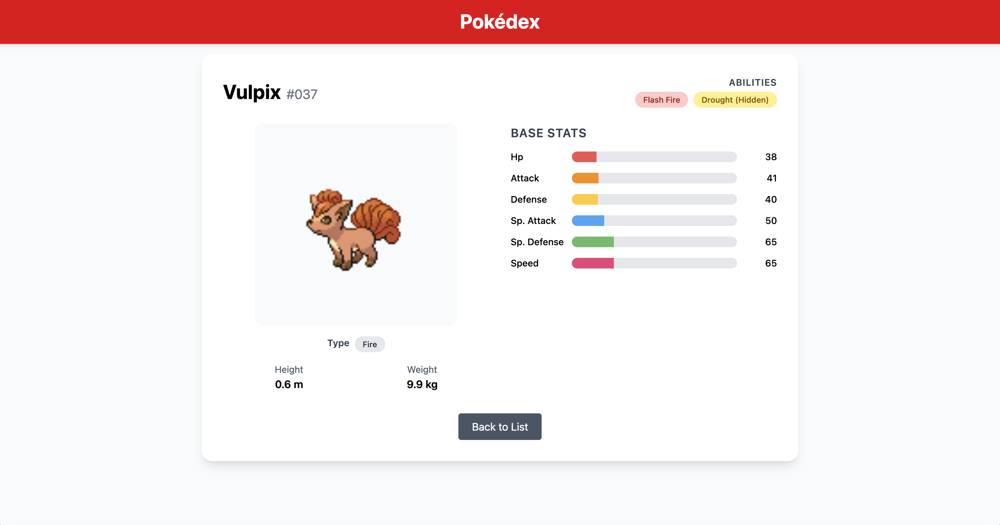

# Pokédex Mini-Challenge

A lightweight, responsive Pokédex app that fetches and displays Pokémon from the [PokéAPI](https://pokeapi.co/). Built with **Vite + React + TypeScript**.

---

## Features

- **List View**: Shows first 50 Pokémon in a responsive grid with sprites and names.
- **Detail View**: Click any Pokémon to see:
  - ID, height, weight
  - Types and abilities (as badges)
  - Key stats (HP, Attack, Defense)
- **Loading States**: Skeleton cards on list, spinner on detail.
- **Error Handling**: Retry button on failure.
- **Routing**: Smooth navigation with `react-router-dom`.
- **Scroll Persistence**: Returns to last scroll position when going back.
- **Image Optimization**: Lazy loading + proper `alt` text.
- **Performance**: `useMemo` to avoid unnecessary re-renders.

---

## Tech Stack

- **Framework**: [Vite](https://vitejs.dev/) + React + TypeScript
- **Routing**: [React Router v6](https://reactrouter.com/)
- **Styling**: [CSS and Tailwind]
- **API**: [PokéAPI](https://pokeapi.co/)

---

## Project Structure
